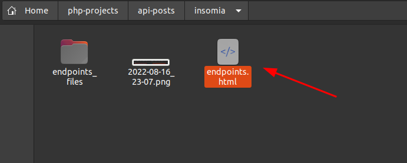
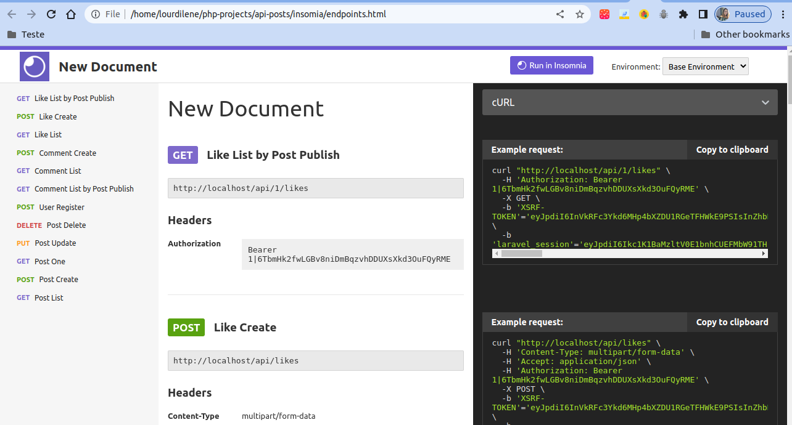
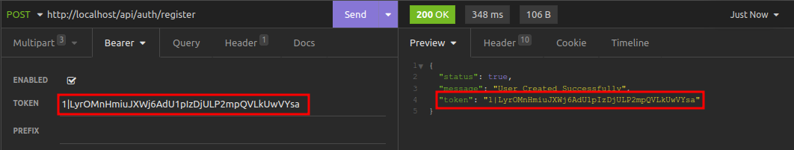

# API-POSTS

Este é um projeto contruído com laravel 9. Para rodá-lo é necessário ter instalado docker desktop.

## Comando docker

    ./vendor/bin/sail up

## Dê permissão para a pasta storage

    lourdilene@lourdilene-Inspiron-5558:~$ cd php-projects/
    lourdilene@lourdilene-Inspiron-5558:~/php-projects$ cd api-posts
    lourdilene@lourdilene-Inspiron-5558:~/php-projects/api-posts$ chmod 777 -R storage

## Acesse o app

    http://localhost/

## Migrations
Acesse o docker e execute as migrations:

    lourdilene@lourdilene-Inspiron-5558:~/php-projects/api-posts$ docker exec -it api-posts-laravel.test-1 bash      
    root@e917382508cb:/var/www/html# php artisan migrate

## Rode os tests
Acesse o containner de banco e rode o comando de migrates para criar as tabelas no banco de teste. 
O comando para rodar os testes é:

    php artisan test

# Queue
Após inserir alguns comentários e likes. Execute o seguinte comando no docker laravel para publicar os comentários e likes

    php artisan queue:work 

# Endpoints
Na pasta do projeto, vá até a pasta 'insomia'. Clique na pasta para que a página abra no navegador. 

A página abrirá no navegador da seguinte forma:

Primeiro crie um usuário e em seguida copie o token para acessar os endpoints.

